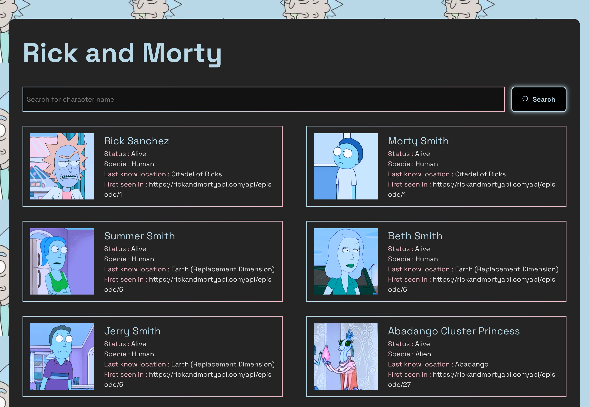

# Rick and Morty App

## 📖 Documentation

### 🚀 What It Does
This is a **Rick and Morty** character explorer application that allows users to:
- Search for characters from the **Rick and Morty API**.
- View details about each character, including their status, species, origin, and episodes.
- Navigate between paginated results.

The app is built using **React 19**, styled with **SCSS**, and fetches data using **Axios**.

---

## ⚙️ Installation & Setup

### 📥 How to Install
Make sure you have **Node.js** installed. Then, clone the repository and install dependencies:

```sh
# Clone the repository
git clone https://github.com/caiqalmeida/rick-and-morty-app.git
cd rick-and-morty-app

# Install dependencies
npm install
```

### ▶️ How to Run
To start the development server, run:
```sh
npm run dev
```
This will launch the app in your browser at **http://localhost:5173** (default Vite port).

### 📦 How to Build
To create an optimized production build, use:
```sh
npm run build
```
The production-ready files will be generated in the `dist/` folder.

### 📤 Deployable Package
The deployable package is the contents of the `dist/` folder after running `npm run build`. It can be deployed to **Vercel**, **Netlify**, or any static hosting provider.

---

## 🛠️ Technical Details

### 🏗️ Technologies Used
| Technology  | Version |
|------------|---------|
| React      | 19.0.0  |
| Vite       | 6.2.0   |
| TypeScript | ~5.7.2  |
| SCSS       | ^1.85.1 |
| Axios      | ^1.8.2  |
| ESLint     | ^9.21.0 |

### 📡 API Used
- **Rick and Morty API**: [rickandmortyapi.com](https://rickandmortyapi.com/)

### 📂 Project Structure
```
rick-and-morty-app/
│-- src/
│   ├── components/       # Reusable UI components
│   ├── pages/            # Page-level components
│   ├── services/         # API service (Axios)
│   ├── hooks/            # Custom React hooks
│   ├── styles/           # SCSS styles
│   ├── types/            # TypeScript type definitions
│   ├── App.tsx           # Main App component
│   └── main.tsx          # Entry point
│
│-- public/               # Static assets
│-- package.json          # Dependencies & scripts
│-- vite.config.ts        # Vite configuration
```

---

## 🖼️ Interface Preview


---

## 📜 License
This project is open-source and free to use. Contributions are welcome!

